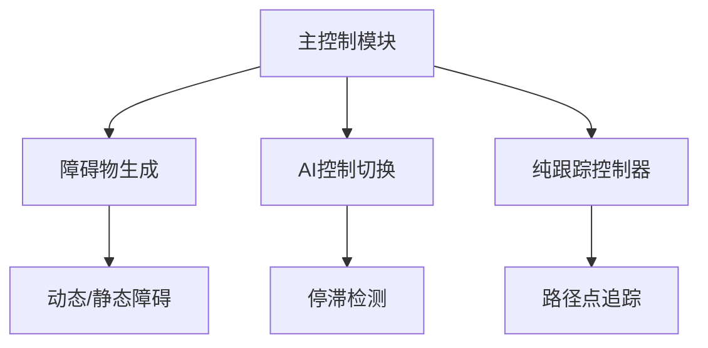

# 项目设计思路

## 背景目标
在有限时间内基于CARLA平台验证混合控制策略的可行性，为后续深入研究打下基础。

## 技术选型
| 技术点           | 方案                | 考量因素               |
|------------------|---------------------|-----------------------|
| 全局路径规划     | CARLA内置AI         | 降低复杂度，快速验证   |
| 局部避障         | 纯跟踪算法          | 实现简单，适合直线场景 |
| 传感器配置       | 多视角摄像头        | 满足基础监控需求       |
| 障碍物生成       | 固定位置+随机偏移   | 平衡可控性与真实性     |

## 模块设计


## 关键算法
- 停滞检测：速度持续 <2.5m/s 超过 0.1 秒
- 控制切换：set_autopilot(False) + 手动油门/转向
- 路径跟踪：纯跟踪公式计算前轮转角

## 数据流
```
sequenceDiagram
    传感器数据->>控制模块: 速度/位置
    控制模块->>决策模块: 停滞状态
    决策模块->>执行模块: 切换控制权
    执行模块->>CARLA: 发送控制指令
```

## 扩展性设计
- 参数配置化：所有阈值通过配置文件管理
- 模块解耦：传感器/控制器独立成类

